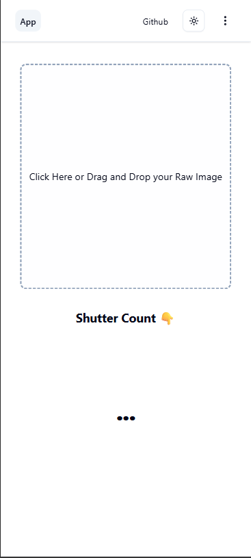

# 📸 Shuttersnap

[]()
[](/LICENSE)

> A free, privacy-focused web tool that instantly checks your Sony camera's shutter count by analyzing RAW files directly in your browser.

## 🌟 Overview

**Shuttersnap** is a client-side web application that extracts shutter count information from camera RAW files without uploading them to any server. Built with Svelte and powered by the dcraw library, it processes files entirely in your browser, ensuring complete privacy and instant results.

### ✨ Key Features

- **🔒 Privacy First**: All processing happens locally - your RAW files never leave your device
- **⚡ Instant Results**: Get shutter count and camera model information instantly with almost zero waiting time.
- **📱 Responsive Design**: Works seamlessly on desktop and mobile devices
- **🚀 No Installation**: Browser-based tool with no software downloads required
- **🆓 Completely Free**: Open source and free to use.
- **🎯 Expanding Camera Support**:
  New models will be added and will expand to more and more brands.

## 🚀 Live Demo

Visit [Shuttersnap](https://chathura-de-silva.github.io/Shuttersnap/) to try it out instantly!

## 🛠️ Technical Architecture

### Frontend Stack

- **Framework**: SvelteKit (v2.x)
- **Language**: TypeScript
- **Styling**: TailwindCSS with custom design tokens
- **Build Tool**: Vite
- **Package Manager**: pnpm

### Core Libraries

- **EXIF Processing**: Custom extraction logic based on shuttertool.com methodology
- **Image Processing**: dcraw library for RAW file handling
- **File Handling**: Browser FileReader API for client-side processing

## 🏗️ Project Structure

```
shuttersnap/
├── .github/workflows/          # GitHub Actions CI/CD
├── .husky/                     # Git hooks for code quality
├── .svelte-kit/               # SvelteKit generated files
├── .vscode/                   # VS Code configuration
├── build/                     # Production build output
├── docs/                      # Documentation files
├── src/
│   ├── lib/
│   │   ├── components/        # Reusable Svelte components
│   │   │   ├── file-uploader.svelte  # File picker area component
│   │   │   └── BuyMeACoffeeButton.svelte
│   │   ├── constants.ts       # Camera models and configurations
│   │   ├── extract.ts         # EXIF extraction logic
│   │   └── utils.ts          # Some common utilities
│   ├── routes/
│   │   ├── +page.svelte      # Home page
│   │   ├── about/            # About page
│   │   ├── faq/              # FAQ page
│   │   └── supported/        # Supported devices pages
│   ├── app.css              # Global styles and CSS variables
│   ├── app.d.ts             # TypeScript declarations
│   └── app.html             # HTML template
├── static/                   # Static assets
├── commitlint.config.js      # Commit message linting
├── eslint.config.js          # ESLint configuration
├── package.json              # Dependencies and scripts
├── svelte.config.js          # Svelte configuration
├── tailwind.config.js        # TailwindCSS configuration
├── tsconfig.json             # TypeScript configuration
└── vite.config.ts            # Vite build configuration
```

## 🚀 Getting Started

### Prerequisites

- **Node.js** 18.0.0 or higher
- **pnpm** 8.0.0 or higher (recommended)

### Installation

1. **Clone the repository**

   ```bash
   git clone https://github.com/chathura-de-silva/Shuttersnap.git
   cd Shuttersnap
   ```

2. **Install dependencies**

   ```bash
   pnpm install
   ```

3. **Start development server**
   ```bash
   pnpm dev
   ```

### Development Scripts

```bash
# Start development server
pnpm dev

# Build for production
pnpm build

# Preview production build
pnpm preview

# Lint code
pnpm lint

# Format code
pnpm format

# Type checking
pnpm check
```

### Responsive Design

- **Mobile-first**: Optimized for mobile devices with progressive enhancement

## 🔍 How It Works

### File Processing Pipeline

1. **File Selection**: User selects a RAW file via drag-and-drop or file picker
2. **Client-side Validation**: File type and size validation
3. **ArrayBuffer Reading**: File read as binary data using FileReader API
4. **EXIF Extraction**: Custom algorithms extract shutter count from EXIF data
5. **Data Parsing**: Camera model and shutter count parsing
6. **Result Display**: Instant display of results with camera information

### Privacy & Security

- **No Server Upload**: Files are processed entirely in the browser
- **Hence No Data Storage**: No persistent storage of user files

## 🤝 Contributing

All contributions are welcome!

### Development Workflow

1. **Fork** the repository
2. **Create** a feature/fix branch (ex - `git checkout -b feature/amazing-feature`)
3. **Commit** your changes (following [Conventional Commits](https://conventionalcommits.org/))
4. **Push** to the branch (`git push origin feature/amazing-feature`)
5. **Open** a Pull Request with the relavant label, i.e. `new-model` , `new-brand` , `bug` , `feature` (use feature if it's not a new model or brand addition)

### Commit Convention

Use [Conventional Commits](https://conventionalcommits.org/) with the following types:

- `feat`: New features
- `fix`: Bug fixes
- `docs`: Documentation changes
- `style`: Code formatting changes
- `refactor`: Code refactoring
- `test`: Adding or updating tests
- `chore`: Maintenance tasks
- `perf`: Performance improvements
- `ci`: CI/CD changes
- `build`: Build system changes
- `revert`: Reverting changes

### Code Quality Tools

- **ESLint**: Code linting with custom rules
- **Prettier**: Code formatting
- **Husky**: Git hooks for pre-commit checks
- **Commitlint**: Commit message validation
- **TypeScript**: Static type checking

## 🐛 Troubleshooting

### Common Issues

#### File Not Working

- Ensure the file is an unedited RAW file from a supported Sony camera
- Check that the file hasn't been processed by photo editing software
- Try a different RAW file from the same camera

#### Browser Compatibility

- Modern browsers required (Chrome 80+, Firefox 75+, Safari 13+)
- File API and ArrayBuffer support required
- JavaScript must be enabled

## 📄 License

This project is licensed under the MIT License - see the [LICENSE](LICENSE) file for details.

## 🙏 Acknowledgments

- **shuttertool** - For the underlying shutter count extraction methodology
- **dcraw library** - For RAW file processing capabilities
- **Sony Camera Community** - For the idea and feedback

## 📞 Support

- **Issues**: Report bugs via [GitHub Issues](https://github.com/chathura-de-silva/Shuttersnap/issues)

  - Please use relavant labels.
  - Request new models only from currently supported brands
  - Check beforehand to avoid duplicated issues.

- **Discussions**: Join discussions in [GitHub Discussions](https://github.com/chathura-de-silva/Shuttersnap/discussions)

<div align="center">

**[Website](https://chathuradesilva.me)** • **[GitHub](https://github.com/chathura-de-silva)** • **[Issues](https://github.com/chathura-de-silva/Shuttersnap/issues)**

</div>

<div style="display: flex; gap: 10px;">
  
  
</div>

<br><br>


